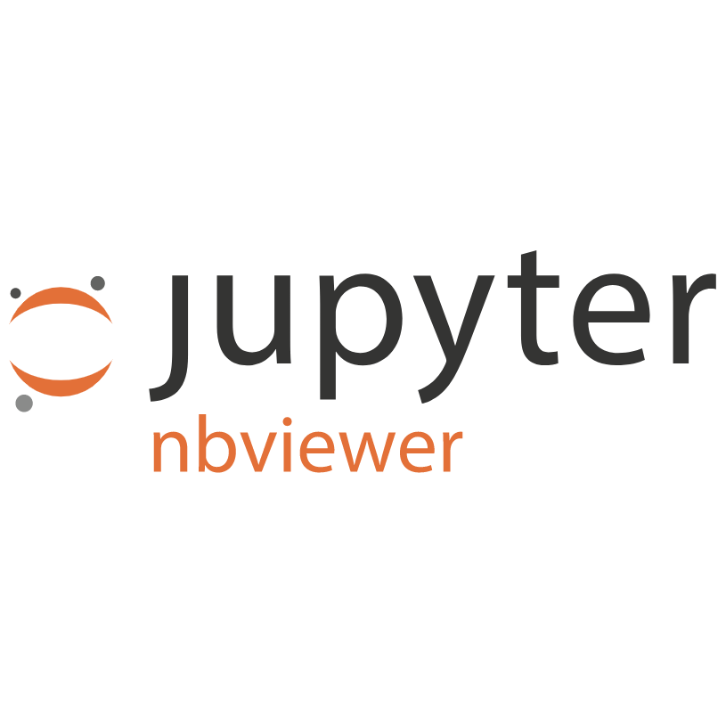

# Fundamentals of Data Analysis Assignment

## G.M.I.T. HDip in Data Analytics

## Autumn/Winter 2021
---

 

### Introduction
The brief for this project was twofold:
1. Create a jupyter notebook looking at the matplotlib.pyplot package
2. Create a jupyter notebook analysing the CAO points data from 2019, 2020, and 2021
 

### Contents of repositry
Included in this repositry are:
- **pyplot.ipynb** - a jupyter notebook discussing matplotlib.pyplot
- **cao.ipynb** - a jupyter notebook analysing the CAO points from 2019, 2020, and 2021 - cao.ipynb
- **READ.md** - this README file
- **assessment.pdf** - the original PDF assessement brief
- **requirements.txt** - file containing all of the python libraries used
- **data** - folder containing all of the relevent data files for the project
- **images** - folder containing all images used in the notebooks
 

### Installation

The jupyter notebooks require a python environment with all of the listed packages in the requirements.txt file installed. The easiest way to do this is with Anaconda which is available from here - https://docs.anaconda.com/anaconda/install/.
 

### Run
Once installed, or the appropriate python environment set up, you can run the jupyter notebooks directly from Terminal (or whatever command line interface you are using). First you need to download the notebook locally, navigate to that location on Terminal, and then open the jupyter app by typing `jupyter lab`. The app will open in a browser window but runs on your local machine. To start you should click on the `kernel` menu and select `Restart Kernel and Run All`.  

The notebooks can also be viewed with nbviewer at the following link - 
 

### The notebooks
The notebooks are fairly self-explanatory. Each runs through the questions asked in the brief with appropriate visualisations. The reader is welcome to change any of the parameters to get a better idea of how it works.
 

### Credits
A lot of the intitial work on this project was based on ideas covered in lectures with Dr. Ian McLoughlin. Further sources are listed at the end of each notebook
 

### contact
caoimhinvallely@gmail.com